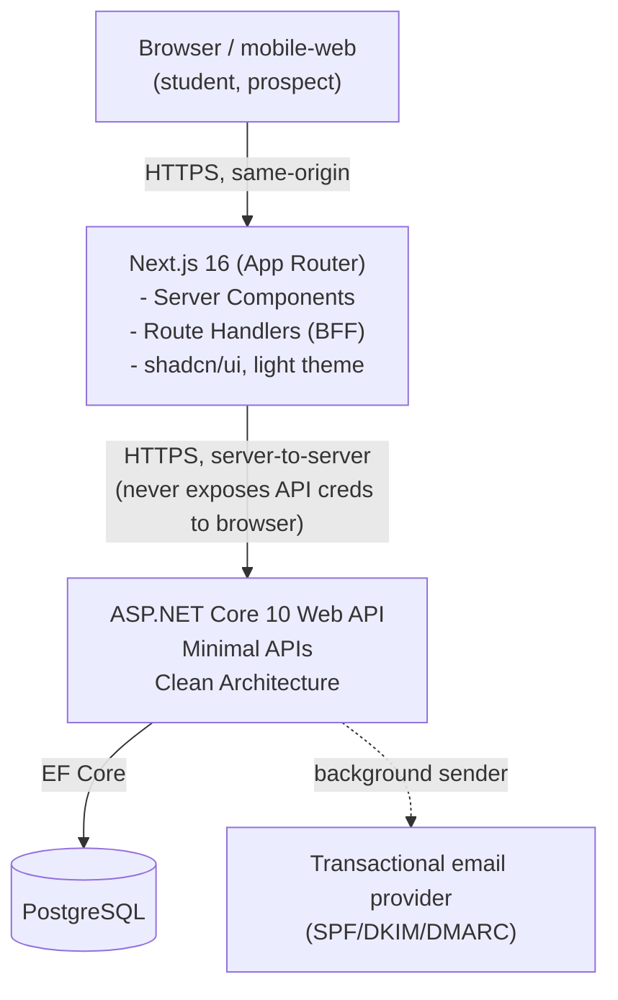

# MIM Student Portal — Architecture Document

**Phase 1: Course Discovery & Enrolment (Web)**

| Field | Value |
|---|---|
| Product | MIM Student Portal |
| Phase | 1 of N — Web |
| Version | 0.1 (draft) |
| Date | 21 August 2026 |
| Owner | Fiqri Ismail |
| Status | **Draft** — derived from PRD v1.0 (baselined 21 Aug 2026) |
| Source | `brain/docs/PRD.md` |

### Change log

| Version | Date | Change |
|---|---|---|
| 0.1 | 21 Aug 2026 | Initial draft, stack decisions confirmed with product owner |

---

## 1. Purpose and scope

This document translates the Phase 1 PRD (`brain/docs/PRD.md`) into a concrete technical architecture: system shape, layering, data model, auth strategy, and cross-cutting concerns. It covers only Phase 1 scope (§2.2 of the PRD) but calls out where a decision is made specifically to avoid rework in later phases (Phase 2 admin, Phase 8 mobile).

Every section below traces back to a PRD requirement where relevant, using the PRD's own IDs (US-x.x, AC-x.x.x).

---

## 2. Stack decisions

| Concern | Decision | Rationale |
|---|---|---|
| Frontend | Next.js 16 (App Router), TypeScript, shadcn/ui, light theme | Global convention; App Router gives file-based routing that maps cleanly to catalog/auth/dashboard slices |
| Backend | ASP.NET Core 10, Minimal APIs | Confirmed by product owner |
| Backend architecture | Clean Architecture (Domain / Application / Infrastructure / API), with **vertical-slice organisation inside Application** | Reconciles "always use vertical slicing architecture" (global convention) with the explicit Clean Architecture request — see §4 |
| Database | PostgreSQL | Confirmed by product owner; supports row-level locking required by AC-4.1.4 |
| ORM | EF Core | Confirmed by product owner |
| Hosting | **Open — not decided** | See §11 |

Both frontend and backend are separate deployables (not a single Next.js full-stack app), so the boundary between them — especially for auth — is a first-class design concern (§6).

---

## 3. System context



The browser talks **only** to Next.js. Next.js is a Backend-for-Frontend (BFF): it renders pages (Server Components for public catalog SEO — AC-3.3.7, OQ-8) and proxies authenticated mutations to the ASP.NET API server-side. This is a deliberate boundary decision — see §6.

---

## 4. Backend architecture — Clean Architecture + vertical slices

### 4.1 Layers

```
apps/api/
├── MIM.Portal.Domain/            # Entities, value objects, domain events, no dependencies
├── MIM.Portal.Application/       # Use cases, organised as vertical slices (see 4.2)
├── MIM.Portal.Infrastructure/    # EF Core, email provider, rate limiter, clock, audit sink
└── MIM.Portal.Api/               # Minimal API endpoints, DI composition root, middleware
```

- **Domain**: `User`, `StudentProfile`, `Course`, `Batch`, `Enrolment`, `AuditLog`, `Token` (PRD §6.1), plus invariants as domain methods (e.g. `Batch.TryReserveSeat()`, `Enrolment.Withdraw()`). No EF Core or ASP.NET references.
- **Application**: business logic, one folder per **feature slice**, not per technical concern. No repository-per-entity abstraction sprawl — each slice owns exactly the query/command it needs.
- **Infrastructure**: `PortalDbContext` (EF Core), migrations, `IEmailSender`, `IClock`, `IAuditWriter`, rate-limiting store.
- **Api**: endpoint groups (`MapGroup`), request/response DTOs, auth/CSRF middleware, problem-details error mapping, OpenAPI.

### 4.2 Vertical slices inside Application

Each PRD epic (E1–E7) maps to a top-level Application folder; each user story maps to a slice folder containing its command/query, handler, validator, and DTO together:

```
Application/
├── Identity/
│   ├── Register/            (US-1.1)  Command, Handler, Validator, Response
│   ├── VerifyEmail/         (US-1.2)
│   ├── Login/                (US-1.3)
│   ├── Logout/                (US-1.4)
│   ├── ResetPassword/       (US-1.5)
├── Profile/
│   ├── GetProfile/          (US-2.1)
│   ├── UpdateProfile/       (US-2.2)
│   ├── ChangePassword/      (US-2.3)
├── Catalog/
│   ├── BrowseCourses/       (US-3.1, US-3.2)
│   ├── GetCourseDetail/     (US-3.3)
├── Enrolment/
│   ├── EnrolInBatch/          (US-4.1)  ← concurrency-critical, see §7.3
│   ├── ListMyEnrolments/    (US-4.2)
│   ├── WithdrawFromBatch/   (US-4.3)
│   ├── GetDashboard/           (US-4.4)
├── Ops/
│   ├── SeedCatalog/         (US-6.1)
│   ├── ExportEnrolments/    (US-6.2)
```

Each slice is self-contained: a handler does not reach into another slice's handler. Shared read models (e.g. "does this batch have capacity") live in Domain or a small shared `Application.Common` folder — kept deliberately thin to avoid it becoming a second architecture.

Mediation between the Api layer and Application slices uses a lightweight in-process mediator (MediatR or a hand-rolled equivalent) purely for consistent request/response plumbing — not to introduce CQRS ceremony beyond what each slice needs.

### 4.3 Why this combination

Clean Architecture's layering enforces the PRD's non-negotiable rule at AC-7.1.2 / §8.7: **all business logic lives server-side**, with a Domain layer that has zero knowledge of HTTP or persistence — enabling Phase 8's mobile client to reuse the exact same Application layer through the same API without any web-specific logic leaking into it. Vertical slicing keeps each user story's logic (and its tests) colocated, so E2/E3/E4 epics can be built and reviewed independently without a shared "god service" accreting cross-cutting logic.

---

## 5. Frontend architecture — Next.js 16

### 5.1 Structure (vertical slice per PRD epic)

```
apps/web/
├── app/
│   ├── (public)/
│   │   ├── catalog/                # US-3.1, US-3.2
│   │   └── courses/[slug]/         # US-3.3
│   ├── (auth)/
│   │   ├── register/               # US-1.1
│   │   ├── verify-email/           # US-1.2
│   │   ├── login/                  # US-1.3
│   │   ├── forgot-password/        # US-1.5
│   │   └── reset-password/         # US-1.5
│   ├── (student)/                  # requires session
│   │   ├── dashboard/              # US-4.4
│   │   ├── profile/                # US-2.1, US-2.2, US-2.3
│   │   └── enrolments/             # US-4.2, US-4.3
│   └── api/                        # Route Handlers = BFF proxy layer (§6)
├── components/ui/                  # shadcn/ui primitives, light theme
├── features/                       # feature-scoped components/hooks per slice above
└── lib/                            # api-client, session helpers, validation schemas
```

- Public catalog and course-detail pages are Server Components for SEO and Core Web Vitals (AC-3.1.8, AC-3.3.7, §8.1 performance targets).
- Authenticated pages (`(student)` group) are gated by a layout-level session check, backed server-side by the API's own authorisation (AC-7.1.2 — hiding UI is never the only control).
- `shadcn/ui` components, light theme, per global convention.

### 5.2 Data fetching

Server Components call the ASP.NET API directly, server-to-server, for reads (catalog, course detail, dashboard, profile). Mutations (register, login, enrol, withdraw, profile update) go through **Route Handlers** in `app/api/*`, which forward the request to ASP.NET, attach server-held credentials, and translate the API's response (including setting/clearing the session cookie) back to the browser. The browser never calls the ASP.NET API directly.

---

## 6. Authentication & session strategy

This is the most consequential cross-cutting decision given the split-service stack.

### 6.1 Decision: Next.js as session-owning BFF

- The **browser only ever talks to Next.js**, same-origin. Next.js issues and owns the session cookie (`HttpOnly`, `Secure`, `SameSite=Lax` — AC-1.6.1), encrypted/signed (e.g. sealed session via `iron-session` or an equivalent).
- On login/register/verify, the Next.js Route Handler calls the ASP.NET API server-to-server (private network or a shared secret/service credential — never exposed to the browser), receives a short-lived signed **API token** representing the authenticated user, and stores it inside the sealed browser session cookie.
- On each subsequent authenticated request, the Route Handler unseals the browser cookie, attaches the API token as a bearer credential to the outbound ASP.NET call, and relays the response.
- **Session regeneration** (AC-1.6.2: on login and password change) and **full session invalidation** (AC-1.5.5, AC-2.3.4: all other sessions killed) are implemented as: ASP.NET maintains a `session_version` (or token-family) per user; the sealed cookie carries the same value; the API rejects any token whose version doesn't match current. Password change / reset bumps the version server-side, atomically invalidating every previously issued token without a distributed session store lookup on every request.
- **CSRF** (AC-1.6.3): since the browser only ever calls same-origin Next.js Route Handlers, standard same-site + double-submit or synchroniser-token CSRF protection is applied at the Next.js boundary. The ASP.NET API additionally requires the internal bearer token on every mutating call, so it is not reachable by a forged cross-site request even if it were exposed directly.

### 6.2 Why not direct browser → ASP.NET cookie auth

Cross-origin cookie auth (Next.js on one origin, API on another) forces `SameSite=None`, which weakens CSRF posture and requires either a shared parent domain or third-party-cookie handling that degrades on Safari/iOS — a real risk given §8.6 treats mobile web as first-class. The BFF pattern avoids this entirely and, as a side benefit, gives Phase 8's native app a clean path: mobile talks directly to the ASP.NET API using standard OAuth2/JWT bearer auth, bypassing the BFF, while the web client keeps cookie-based sessions. No rework of the API's core auth model is needed when Phase 8 arrives — only an additional token-issuance endpoint.

### 6.3 Identity implementation

ASP.NET Identity (or a slim custom identity layer over EF Core, given the constrained field set in PRD §6.1) handles password hashing (Argon2id via a custom `IPasswordHasher`, since ASP.NET Identity defaults to PBKDF2 — §8.3 requires a memory-hard algorithm), lockout/backoff (AC-1.3.3), and token issuance for email verification and password reset (`Token` entity, §6.1).

---

## 7. Data architecture

### 7.1 Entities

Direct mapping from PRD §6.1 to EF Core entities in `MIM.Portal.Domain`, one table per entity, `snake_case` Postgres naming via EF Core's naming convention. No changes to the PRD's attribute list; see PRD §6.1 for the authoritative field list.

### 7.2 Key constraints enforced at the database level, not just application code

- Unique index on `users.email` (case-insensitive — citext or a normalised lowercase column with a unique index).
- Unique partial index on `enrolments (student_profile_id, batch_id) WHERE status = 'ACTIVE'` (PRD §6.1) — this is the backstop for AC-4.1.5 and AC-4.1.12, not just an application-level check.
- Foreign keys with `RESTRICT`/`NO ACTION` on delete for all Enrolment/AuditLog references — nothing in this domain is ever hard-deleted (AuditLog is append-only per AC-7.2.3; Enrolment is soft-state via `WITHDRAWN`, not deleted per AC-4.3.3).

### 7.3 Concurrency: atomic seat capacity (AC-4.1.4)

This is the single highest-risk piece of the system (PRD R1) and drives its own design:

1. `EnrolInBatch` handler opens an EF Core transaction at `READ COMMITTED` (Postgres default) and issues `SELECT ... FOR UPDATE` on the target `batches` row, taking a row-level lock before checking capacity.
2. Remaining seats = `batch.capacity − COUNT(enrolments WHERE batch_id = @id AND status = 'ACTIVE')`, computed inside the same transaction, under the lock.
3. If seats remain, insert the `Enrolment` row and commit. If not, roll back and return a domain error ("batch is now full").
4. The unique partial index (§7.2) is a second, independent safety net against duplicate active enrolments even if application logic has a bug.
5. Idempotency (AC-4.1.12): the client (Next.js Route Handler) generates an idempotency key per enrolment attempt; the API stores a short-lived idempotency record keyed on `(student_profile_id, batch_id, idempotency_key)` so a resubmitted request returns the original result rather than attempting a second insert.

This must be covered by an explicit concurrency test that fires concurrent enrolment requests at a batch with one remaining seat and asserts exactly one success (§8.7 requirement, restated from PRD).

### 7.4 Migrations

EF Core Code-First migrations, generated from Domain/Infrastructure, applied via a documented CI/CD step — never run ad hoc against production (ties into AC-6.1.6's runbook requirement for the separate catalog-seeding command, which is a distinct, idempotent script, not a migration).

---

## 8. API design

Minimal API endpoint groups, one per epic, versioned under `/api/v1`:

| Group | Endpoints (indicative) | PRD source |
|---|---|---|
| `/api/v1/auth` | `POST /register`, `POST /verify-email`, `POST /login`, `POST /logout`, `POST /forgot-password`, `POST /reset-password` | E1 |
| `/api/v1/profile` | `GET /me`, `PATCH /me`, `POST /me/change-password` | E2 |
| `/api/v1/courses` | `GET /courses`, `GET /courses/{slug}` (public, no auth) | E3 |
| `/api/v1/enrolments` | `POST /batches/{id}/enrol`, `GET /enrolments/me`, `POST /enrolments/{id}/withdraw` | E4 |
| `/api/v1/dashboard` | `GET /dashboard` | US-4.4 |
| `/api/v1/ops` (internal-only, not exposed via BFF) | `POST /catalog/seed`, `POST /enrolments/export` | E6 |

All error responses use RFC 7807 `application/problem+json`, mapped by a single middleware in the Api layer — this is what backs AC-7.3.1 (no stack traces) and carries the correlation ID from AC-7.3.2.

---

## 9. Cross-cutting concerns

| Concern | Approach | PRD source |
|---|---|---|
| Validation | FluentValidation per Application slice, request-shape validation at the Api layer boundary | Various AC |
| Audit logging | `IAuditWriter` in Infrastructure, called explicitly at the end of each slice handler that performs a listed action; append-only table, no update/delete DbSet exposed | US-7.2 |
| Rate limiting | ASP.NET's built-in `Microsoft.AspNetCore.RateLimiting`, keyed by IP and/or account per endpoint (registration, login, resend, reset) | AC-1.1.9, AC-1.2.6, AC-1.3.3, AC-1.5.7 |
| Email | `IEmailSender` in Infrastructure wraps the transactional provider SDK; sends are queued (`Channel<T>` + hosted background service, or Hangfire if retry/observability needs grow) so latency/failure never blocks the enrolment transaction | AC-5.2.3, AC-5.2.4 |
| Error pages | Next.js custom error/404/403 pages, correlation ID surfaced from the API's problem-details response | US-7.3 |
| Security headers | Set at the Next.js edge/middleware layer (CSP, X-Content-Type-Options, Referrer-Policy, X-Frame-Options) | §8.3 |
| Analytics | Client-side event dispatch from Next.js (catalog viewed, registration started, etc.) to a privacy-respecting analytics sink — no personal data forwarded | US-7.4, §8.4 |
| Accessibility | shadcn/ui's Radix primitives as the base (keyboard/focus support built in); automated axe-core check in CI + manual pass before release | §8.5 |
| Localisation | All frontend strings externalised (e.g. `next-intl` message catalogs) from day one, English-only content, Asia/Colombo date formatting | §8.8 |

---

## 10. Testing strategy

| Layer | Tooling (indicative) | Focus |
|---|---|---|
| Domain/Application | xUnit | Business rules per slice, especially `Batch` capacity invariants |
| Concurrency | xUnit + `Testcontainers` (real Postgres) | AC-4.1.4 — concurrent enrolment race test, required, not optional |
| API | xUnit + `WebApplicationFactory` | Auth flow end-to-end (register → verify → login → enrol → withdraw), authorisation checks (AC-7.1.2) |
| Frontend | Vitest/RTL + Playwright | Form validation UX, accessibility smoke tests, BFF proxy correctness |
| CI | Runs full suite + dependency vulnerability scan on every change | §8.7 |

---

## 11. Open architecture decisions

| # | Decision | Status | Notes |
|---|---|---|---|
| AD-1 | Hosting/deployment target | **Open** | Needs an ASP.NET-capable host (Azure App Service, AWS ECS/Fargate, Fly.io, or a VPS) alongside Next.js hosting (Vercel or same host) and a managed Postgres. Revisit once environment/budget constraints are known. |
| AD-2 | In-process mediator library vs hand-rolled | Resolved | MediatR (license terms changed in recent versions — confirm current licensing before adopting) vs a small custom `ICommandHandler<TCommand,TResult>` interface. Resolved during BE-1.1: hand-rolled `ICommandHandler<TCommand,TResult>`, no MediatR dependency — see [`docs/superpowers/specs/2026-08-21-be-1.1-self-registration-design.md`](../../docs/superpowers/specs/2026-08-21-be-1.1-self-registration-design.md). |
| AD-3 | Background job runner for email retries | Resolved | Escalate to Hangfire/Quartz if retry/observability needs grow beyond AC-5.2.4's "at least 3 retries with backoff". Resolved during BE-1.1: `Channel<T>` + a hosted `BackgroundService`, with a logging email sender standing in for a real provider for now — see [`docs/superpowers/specs/2026-08-21-be-1.1-self-registration-design.md`](../../docs/superpowers/specs/2026-08-21-be-1.1-self-registration-design.md). |
| AD-4 | Identity: ASP.NET Identity vs custom slim layer | Resolved | PRD's `User`/`Token` shape is narrower than ASP.NET Identity's defaults; a thin custom layer avoids fighting Identity's schema assumptions. Resolved during BE-1.1, overriding this row's prior "leaning custom" note: ASP.NET Identity, confined entirely to `Infrastructure` (`ApplicationUser` never leaks into Domain) — see [`docs/superpowers/specs/2026-08-21-be-1.1-self-registration-design.md`](../../docs/superpowers/specs/2026-08-21-be-1.1-self-registration-design.md). |

These are implementation-detail decisions, independent of the PRD's own open questions (PRD §11, OQ-1–OQ-9), which remain product/legal decisions and are not duplicated here.

---

## 12. Traceability to PRD non-goals

Nothing in this architecture introduces functionality from PRD §2.2 (payments, LMS delivery, admin UI, chat, etc.). The Clean Architecture boundary and vertical-slice Application layer are specifically chosen so that Phase 2 (admin module) and later phases add new slices and new Api endpoint groups without modifying Phase 1's slices — see §4.3.
